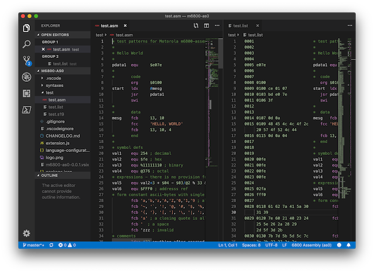

# m6800-as0 README

Syntax higlighting for 6800 assembly ([as0](https://github.com/JimInCA/motorola-6800-assembler)).

## Requirements

[motorola-6800-assembler (as0)](https://github.com/JimInCA/motorola-6800-assembler)
is required for assemble command.

To run as0 on Windows, use Windows10 WSL.

## Known Issues

* An empty listing file is generated if no listing option is specified.

## Release Notes

### 0.0.1

Initial release of m6800-as0.

**Enjoy!**
